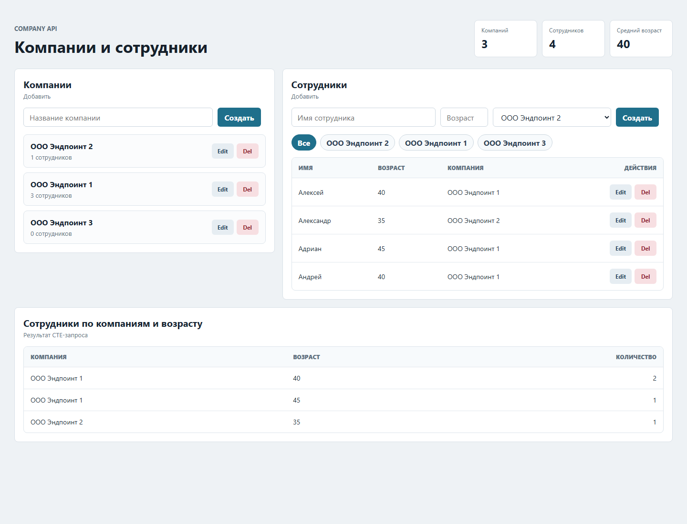
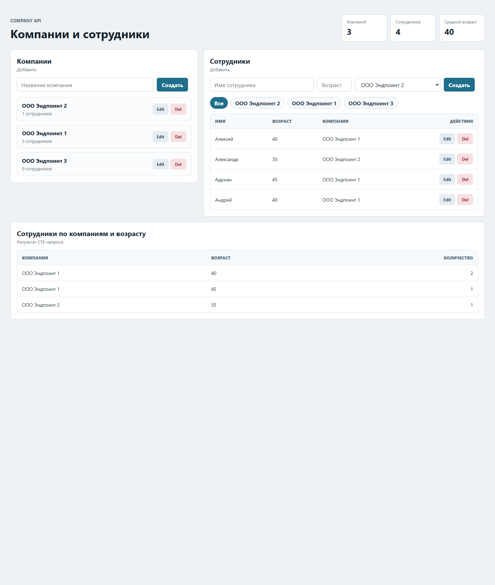

# Company

Приложение для управления компаниями и сотрудниками.

Стек backend: Java 21, Micronaut 4, Micronaut Data Hibernate JPA, PostgreSQL, Liquibase, MapStruct, Lombok, Micrometer/Prometheus.

Стек frontend: JavaScript, React, Redux Toolkit, HTML, CSS, Vite.

Мониторинг: Prometheus, Grafana.

## Быстрый старт

### Требования

- Java 21
- Docker Desktop
- Node.js и npm
- PostgreSQL на `localhost:5432`

По умолчанию backend подключается к PostgreSQL:

```text
jdbc:postgresql://localhost:5432/postgres
username: postgres
password: postgres
```

Можно переопределить доступы через переменные окружения:

```powershell
$env:DB_USERNAME="postgres"
$env:DB_PASSWORD="postgres"
```

Схема `company` создаётся автоматически, таблицы накатываются через Liquibase.

### Запуск backend

```powershell
cd C:\java\projects\micronaut\company
.\gradlew.bat run
```

Backend будет доступен на:

```text
http://localhost:8080
```

### Запуск frontend

```powershell
cd C:\java\projects\micronaut\company\frontend
npm install
npm run dev
```

Frontend будет доступен на:

```text
http://127.0.0.1:5173
```

Vite проксирует запросы `/companies` и `/employees` на backend `http://localhost:8080`.

### Запуск Prometheus и Grafana

```powershell
cd C:\java\projects\micronaut\company
docker compose up
```

Prometheus:

```text
http://localhost:9090
```

Grafana:

```text
http://localhost:3000
```

Логин Grafana:

```text
admin
```

Пароль по умолчанию:

```text
admin
```

Пароль можно переопределить:

```powershell
$env:GRAFANA_ADMIN_PASSWORD="my-secret"
docker compose up
```

Grafana datasource и dashboard описаны файлами в проекте:

- `grafana/provisioning/datasources/prometheus.yml`
- `grafana/provisioning/dashboards/dashboards.yml`
- `grafana/dashboards/company-http.json`

Micronaut Prometheus endpoint:

```text
http://localhost:8080/prometheus
```

## REST API

API реализован на Micronaut Controllers + Services + Repositories.

### Companies

Получить все компании:

```http
GET http://localhost:8080/companies
```

Получить компанию по id:

```http
GET http://localhost:8080/companies/{id}
```

Создать компанию:

```http
POST http://localhost:8080/companies
Content-Type: application/json

{
  "name": "ООО Эндпоинт 1"
}
```

Обновить компанию:

```http
PUT http://localhost:8080/companies/{id}
Content-Type: application/json

{
  "name": "ООО Эндпоинт 2"
}
```

Удалить компанию:

```http
DELETE http://localhost:8080/companies/{id}
```

При удалении компании удаляются её сотрудники. Связь хранится через `employees.company_id` с `ON DELETE CASCADE`.

### Employees

Получить всех сотрудников:

```http
GET http://localhost:8080/employees
```

Получить сотрудника по id:

```http
GET http://localhost:8080/employees/{id}
```

Создать сотрудника:

```http
POST http://localhost:8080/employees
Content-Type: application/json

{
  "name": "Алексей",
  "age": 40,
  "companyId": "uuid-компании"
}
```

Обновить сотрудника:

```http
PUT http://localhost:8080/employees/{id}
Content-Type: application/json

{
  "name": "Александр",
  "age": 35,
  "companyId": "uuid-компании"
}
```

Удалить сотрудника:

```http
DELETE http://localhost:8080/employees/{id}
```

## UI

UI реализован на React + Redux Toolkit + Vite.

Возможности:

- просмотр компаний;
- создание, редактирование и удаление компаний;
- просмотр сотрудников;
- создание, редактирование и удаление сотрудников;
- выбор компании для сотрудника;
- фильтр сотрудников по компании;
- фронтенд-валидация пустого названия компании, пустого имени сотрудника и пустого возраста;
- отчёт "Сотрудники по компаниям и возрасту".

Отчёт внизу страницы эквивалентен SQL-группировке:

```sql
WITH cte_count_employee AS (
    SELECT
        e.company_id,
        e.age,
        COUNT(*) AS count_employee
    FROM company.employees e
    GROUP BY
        e.company_id,
        e.age
)
SELECT
    c.name,
    cce.age,
    cce.count_employee
FROM company.companies c
INNER JOIN cte_count_employee cce
    ON c.id = cce.company_id;
```

На фронтенде отчёт считается из данных `GET /companies` и `GET /employees`.

### Скриншоты

Основной экран:



Отчёт по сотрудникам:



## Тесты

Проект покрыт тестами по основным слоям.

Стек тестов:

- JUnit 5
- Micronaut Test
- Micronaut HTTP Client
- Testcontainers PostgreSQL
- Gradle Test

Покрыты:

- controllers: `CompanyController`, `EmployeeController`;
- mappers: `CompanyMapper`, `EmployeeMapper`;
- repositories: `CompanyRepository`, `EmployeeRepository`;
- services: `CompanyService`, `EmployeeService`;
- Liquibase schema checks;
- удаление сотрудников при удалении компании;
- создание сотрудника только для существующей компании.

Запуск тестов:

```powershell
cd C:\java\projects\micronaut\company
.\gradlew.bat test
```

## Полезные команды

Сборка backend:

```powershell
.\gradlew.bat build
```

Сборка frontend:

```powershell
cd frontend
npm run build
```

Остановить frontend dev server:

```powershell
Ctrl+C
```

Остановить Prometheus и Grafana:

```powershell
docker compose down
```

Проверить Prometheus targets:

```text
http://localhost:9090/targets
```

PromQL для Grafana Time series по `GET /employees`:

```promql
rate(http_server_requests_seconds_count{uri="/employees", method="GET"}[5m])
```
